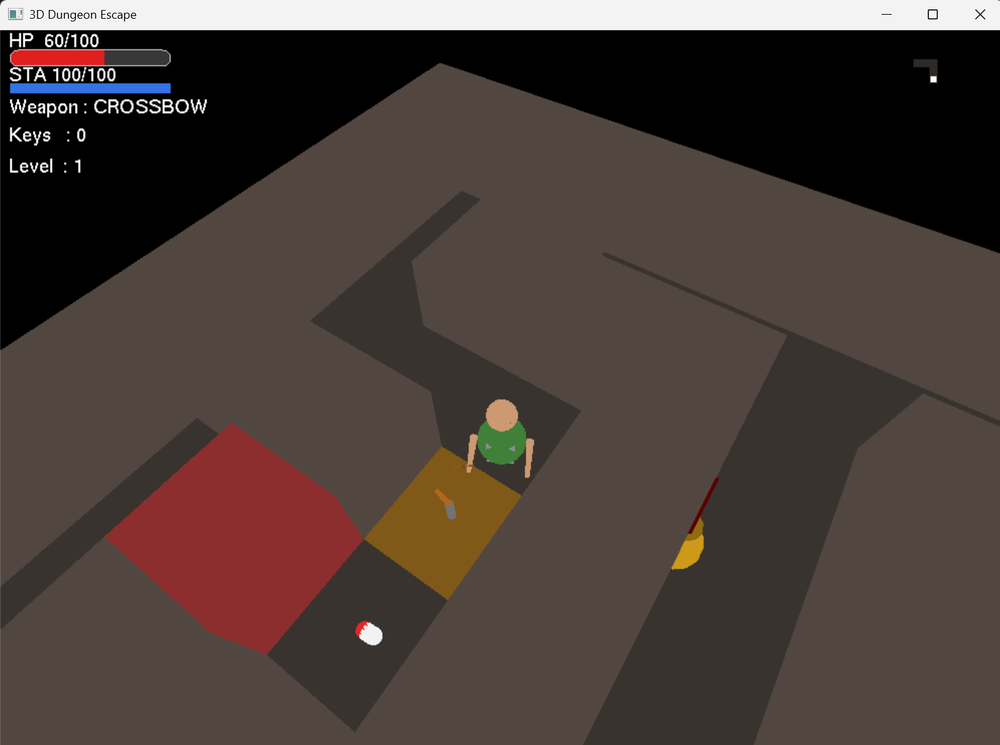
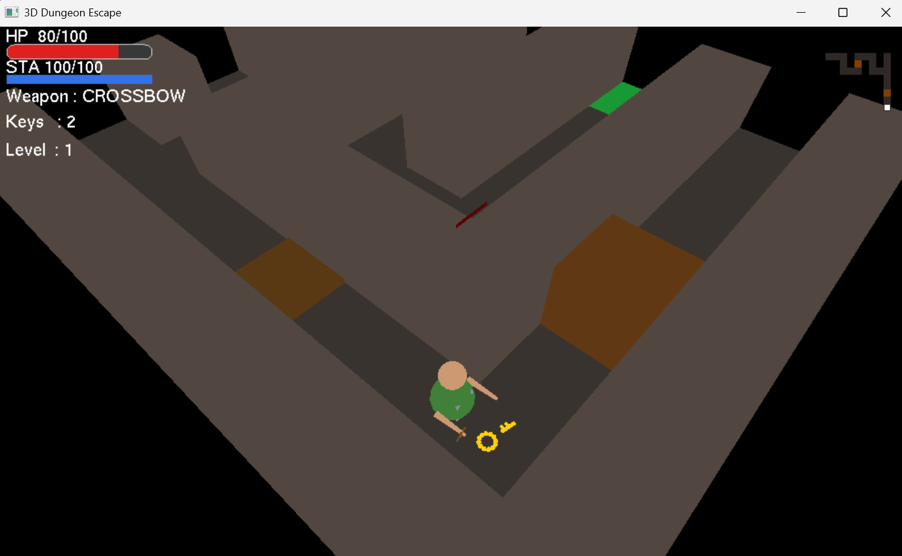
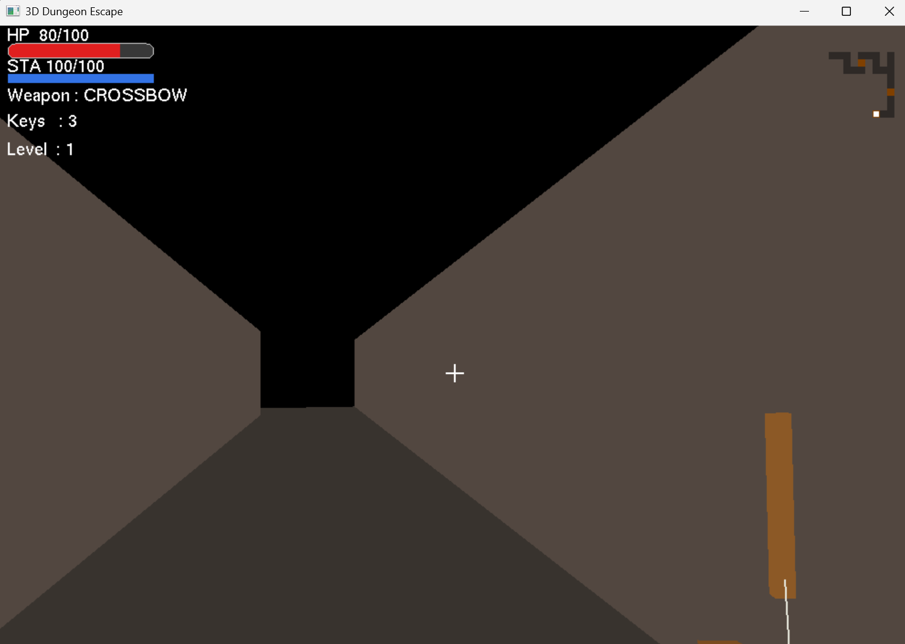

# 🏰 3D Dungeon Escape

[](https://www.python.org/)
[](http://pyopengl.sourceforge.net/)
[](LICENSE)

A fully functional 3D dungeon crawler developed using Python and PyOpenGL, featuring procedural dungeon generation, real-time combat, enemy AI, and immersive first/third-person perspectives.

## 📋 Table of Contents
- [Overview](#-overview)
- [Features](#-features)
- [Technology Stack](#-technology-stack)
- [Installation](#-installation)
- [Controls](#-controls)
- [Game Mechanics](#-game-mechanics)
- [Development Team](#-development-team)
- [System Architecture](#-system-architecture)
- [Future Improvements](#-future-improvements)
- [Screenshots](#-screenshots)
- [License](#-license)

## 🎮 Overview

**3D Dungeon Escape** is an immersive dungeon crawler where players navigate through procedurally generated 3D mazes, combat enemies, solve puzzles with doors and levers, collect items, and ultimately reach the exit to progress through levels. The game demonstrates advanced computer graphics concepts including real-time rendering, geometric transformations, collision detection, and 2D UI overlays within a 3D environment.

## ✨ Features

### Core Gameplay
- **Procedural Dungeon Generation** - Unique maze layouts for each level using randomized seeds
- **Dual Combat System** - Switch between melee (sword) and ranged (crossbow) weapons
- **Dynamic Enemy AI** - Multiple enemy types with unique behaviors and attack patterns
- **Boss Battles** - Special boss enemies every 3 levels with phase changes
- **Interactive Environment** - Locked doors, levers, keys, and health packs

### Visual & UI Features
- **Toggleable Camera** - Switch between first-person and third-person views (V key)
- **Head-bob Effect** - Immersive camera movement when moving/running
- **Minimap System** - Reveals only explored areas with enemy indicators
- **Health Bars** - Visual health bars above enemies
- **Damage Feedback** - Red flash effect when taking damage
- **Custom HUD** - Health, stamina, weapon, key count, and level display
- **Third-Person Weapon Model** - Visible weapon when in third-person mode

### Technical Features
- **Save/Load System** - Persist game state using JSON file I/O
- **Collision Detection** - Smooth wall collision physics
- **Stamina System** - Sprinting consumes stamina with regeneration
- **Projectile System** - Physics-based ranged combat
- **Level Progression** - Increasing difficulty with each level

## 🛠 Technology Stack

| Component | Technology |
|-----------|------------|
| Programming Language | Python 3 |
| Graphics API | OpenGL (PyOpenGL) |
| Windowing | GLUT |
| Utilities | GLU |
| Data Handling | JSON |

## 📦 Installation

### Prerequisites
- Python 3.7 or higher
- pip package manager

### Step 1: Clone the Repository
```bash
git clone https://github.com/DeadboyTALHA/3D-Dungeon-Escape-Python-Game.git
cd 3D-Dungeon-Escape-Python-Game
```

### Step 2: Install Dependencies
```bash
pip install PyOpenGL PyOpenGL_accelerate
```

### Step 3: Run the Game
```bash
3D-Dungeon-Escape.py
```

## 🎮 Controls

### Movement & Camera
| Key | Action |
|-----|--------|
| **W / S** | Move forward / backward |
| **A / D** | Rotate left / right |
| **Arrow Keys** | Look around (1st person) / Orbit camera (3rd person) |
| **L** | Toggle sprint (hold for temporary sprint) |
| **V** | Toggle 1st person / 3rd person view |

### Combat & Interaction
| Key | Action |
|-----|--------|
| **Left Click** | Attack with current weapon |
| **Right Click / Q** | Switch weapon (Sword ↔ Crossbow) |
| **E** | Interact (doors, levers, items) |

### UI & Game Management
| Key | Action |
|-----|--------|
| **TAB** | Toggle minimap |
| **F5** | Save game |
| **F9** | Load game |
| **R** | Restart current level |
| **N** | Next level (after completing current level) |
| **ESC** | Exit game |

## ⚔️ Game Mechanics

### Combat System
| Weapon | Damage | Cooldown | Range | Type |
|--------|--------|----------|-------|------|
| **Sword** | 35 | 0.6s | Close (1.5x cell) | Melee |
| **Crossbow** | 50 | 1.2s | Long (8x cell) | Ranged |

### Enemy Types
| Type | Health | Speed | Damage | Attack Range | Description |
|------|--------|-------|--------|--------------|-------------|
| **Melee** 🟥 | 80 | 60 | 15 | 0.8x cell | Standard melee attacker |
| **Ranged** 🟨 | 50 | 40 | 20 | 5x cell | Shoots projectiles from distance |
| **Fast** 🟩 | 40 | 110 | 10 | 0.9x cell | Quick but fragile |
| **Boss** 🟪 | 400 | 50 | 30 | 1.2x cell | Appears every 3 levels, phase change at 50% HP |

### Items & Pickups
| Item | Effect | Spawn Rate |
|------|--------|-------------|
| 🔑 **Key** | Opens locked doors | Random |
| 💊 **Health Pack** | Restores 40 HP | Random |

### Player Stats
| Stat | Base Value | Notes |
|------|------------|-------|
| Health | 100/100 | Restored via health packs |
| Stamina | 100/100 | Consumed while sprinting, regenerates when not sprinting |
| Movement Speed | 150 (walk) / 240 (sprint) | Sprint consumes stamina |
| Attack Cooldown | Weapon-dependent | Shared cooldown per weapon |

### Level Progression
- Procedurally generated 11x11 grid dungeons
- Exit appears at dead-end locations
- Boss appears every 3 levels
- Enemy count increases with level: `min(4 + level*2, available_cells)`
- Level generation uses deterministic seeds: `seed = level * 7 + 423`

### Combat Mechanics
- **Sword Attack**: 70° cone in front of player, requires facing enemy
- **Crossbow**: Linear projectile with collision detection
- **Damage Flash**: Visual feedback when enemies are hit (0.2s red flash)
- **Invincibility Frames**: 0.3s damage cooldown on player
- **Boss Phase Change**: At 50% HP, boss speed increases by 60% and gains special attacks

## 👥 Development Team

### Member 1: Minhaz - Core Mechanics & Player
- WASD movement with smooth collision detection
- Health, stamina, and inventory system
- Dual-weapon combat system
- Object interaction system (doors, levers, items)
- Procedural dungeon generation algorithm

### Member 2: Farhan - Enemies & Combat
- Head-bob camera effect
- Enemy AI with pathfinding and steering behavior
- Multiple enemy types with unique patterns
- Visual combat feedback (health bars, damage flash)
- Hit detection and cooldown system
- Boss enemy with phase changes

### Member 3: Nabila - World & Progression
- Minimap with exploration tracking
- Level progression system (locked doors, levers)
- Save/load functionality using JSON
- First-person and third-person camera toggling

## 🏗 System Architecture

### Coordinate System
- **X-axis**: Horizontal east direction
- **Y-axis**: Horizontal north direction  
- **Z-axis**: Vertical height

### Rendering Pipeline
1. Clear buffers
2. Setup camera and fog effects
3. Render dungeon geometry
4. Render enemies and items
5. Overlay HUD and minimap
6. Swap buffers

### Game Loop
```
Input Handling → Physics/Collision → AI Updates → 
Combat Logic → Rendering → Display
```

## 🔮 Future Improvements

- [ ] Sound effects and background music
- [ ] Environmental traps (spikes, arrows, fire)
- [ ] Puzzle elements (pressure plates, riddles)
- [ ] Enhanced enemy AI (flanking, hiding)
- [ ] More weapon types (magic staff, daggers)
- [ ] Dungeon secrets and hidden rooms
- [ ] Multiplayer support
- [ ] Level editor

## 📸 Screenshots

### Gameplay View


### HUD and Inventory


### Minimap System


## 📁 Project Structure

```
3d-dungeon-escape/
├── dungeon_escape.py      # Main game file
├── dungeon_save.json      # Saved game data (auto-generated)
├── README.md             # This file
└── CSE423 Project Report.pdf  # Project documentation
```

## 🎯 Learning Outcomes

This project demonstrates:
- Real-time 3D rendering with OpenGL
- Geometric transformations and matrix operations
- Collision detection algorithms
- Procedural content generation
- Game AI and pathfinding
- UI/UX design in 3D environments
- State management and save systems

## 🤝 Contributing

This project was developed as a course project for CSE423 - Computer Graphics. While not actively maintained, feel free to fork and experiment!

## 📄 License

This project is for educational purposes. MIT License - feel free to use and modify for learning.

## 🙏 Acknowledgments

- BRAC University - CSE423: Computer Graphics Course
- PyOpenGL documentation and community
- OpenGL specification and tutorials

---

## 🚀 Running the Game

```bash
# Make sure you have PyOpenGL installed
pip install PyOpenGL PyOpenGL_accelerate

# Run the game
python 3D-Dungeon-Escape.py

# You should see the console output with controls
# ============================================================
#   3D DUNGEON ESCAPE  —  Controls
#   W/S             → Move forward/backward
#   A/D             → Rotate left/right
#   ...
# ============================================================
```

## 🐛 Known Issues & Troubleshooting

- **No rendering**: Ensure your system supports OpenGL
- **Slow performance**: Reduce window size or view distance
- **Save file errors**: Check write permissions in game directory
- **GLUT initialization fails**: Install freeglut3 on Linux

## 📊 Performance Tips

- The minimap only renders explored areas for efficiency
- View culling limits rendering to 6 cells in each direction
- Particle effects are minimal to maintain frame rate

---

**Enjoy exploring the dungeons!** 🗡️🛡️

*Created with ❤️ for CSE423 - Computer Graphics Course*
